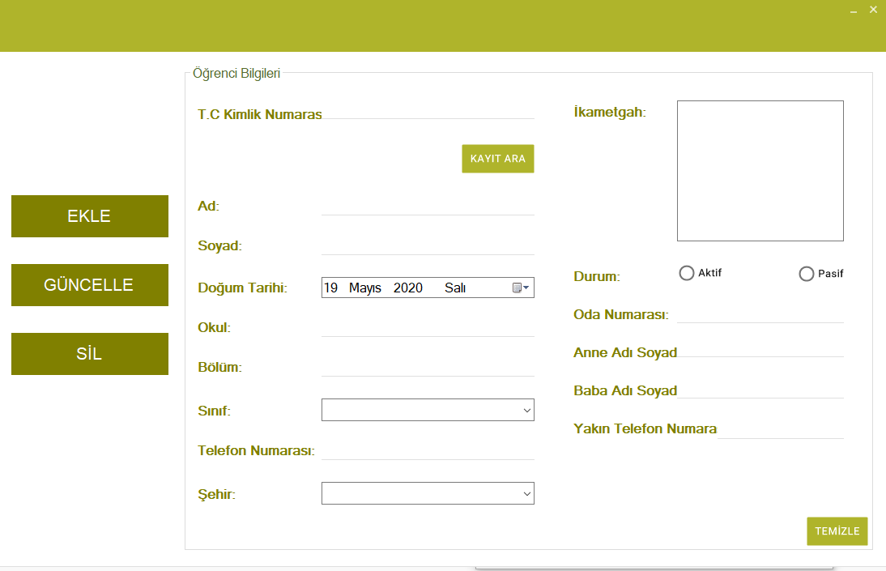

# yurt-otomasyonu
Temel işlemleri yapan yurt otomasyonudur.Personellerin kullandığı bir otomasyon olarak düşünülmüştür. Öğreci, Personel, Ödeme ve Ziyaretçi bölümleri yer almaktadır. Ekleme, silme ve güncelleme işlemleri yapılabilir.

 Projeyi çalıştırdıktan sonra giriş için kullanıcı adı: deneme/ şifre: 123 ile giriş yapılabilir.
 Kodu kendi bilgisayarınızda çalıştırmak için Access veritabanı yolunu kendiniz değiştirmelisiniz.
 Exp: Data Source= Your Access Path (// ile)
 
 Kullanılan Araçlar: C#, MaterialSkin Package ve Access 
 
 Giriş Sayfası
 
 
 
 
 Öğrenci Kayıt Sayfası
 
 
